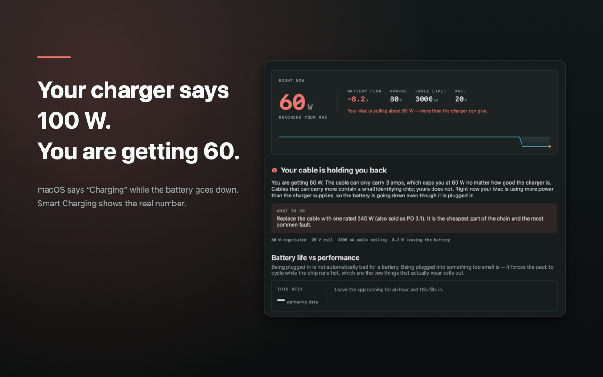

# Mac App Store Screenshots

A skill that generates Mac App Store and marketing screenshots for macOS apps.

Every screenshot generator I could find targets iPhone, iPad and Android. The
Mac App Store needs 16:10 landscape at its own set of sizes, and nothing
covered it — so this does.



Left: your headline. Right: the real app window, framed and shadowed. Rendered
at every size Apple accepts.

## Why a separate tool

The Mac App Store has requirements the iOS tools do not produce:

| Requirement | Value |
|---|---|
| Aspect ratio | 16:10 landscape |
| Accepted sizes | 1280×800, 1440×900, 2560×1600, 2880×1800 |
| Format | RGB PNG or JPEG, **flattened, no alpha** |
| Count | 1 minimum, 10 maximum |
| Content | Must show the **real** app interface |

That last rule is what gets listings rejected. Apple will not accept a
marketing illustration, a device mockup, or an iOS build presented as a Mac
app. You *may* place the real window on a background and add captions — which
is exactly what this produces.

## Use it

No install, no dependencies, no network. macOS with Xcode command line tools
is all it needs.

```bash
swift makeshots.swift screenshots.json
```

### 1. Capture the real app

Normal screenshots. `⌘⇧4` then Space captures a window cleanly; the system
shadow gets trimmed by the rounded frame this applies.

### 2. Describe the slides

```json
{
  "imageDir": "docs/images",
  "outputDir": "docs/appstore",
  "slides": [
    {
      "file": "capture.png",
      "headline": "One claim,\nbroken across two lines.",
      "subhead": "One supporting sentence. Keep it under about twenty words.",
      "tint": [0.31, 0.76, 0.85]
    }
  ]
}
```

`tint` is sRGB 0–1. It colours the accent rule and a soft background wash, so
a set of slides reads as one family while staying individually
distinguishable in a listing.

### 3. Upload

Output lands in `outputDir/2880x1800/` and `outputDir/1280x800/`. Upload the
2880×1800 set — Apple downscales for smaller displays, so starting from the
largest gives the sharpest result on Retina.

## Writing slides that work

The first slide does almost all the work; many people never scroll past it.

- **Headline is a claim, not a label.** "Your charger says 100 W. You are
  getting 60." beats "Power monitoring." Use `\n` to place the line break
  yourself rather than letting it wrap somewhere awkward.
- **Subhead is one sentence** — what the app does about the problem the
  headline names.
- **Order**: problem → mechanism → resolution → who it is for. Each slide
  should still stand alone, because people land on them out of order.

## Before you upload

**Check every capture came from the current build.** A screenshot taken
before a bug fix will happily advertise the bug. This is not hypothetical —
the first run of this tool produced a slide headlined "It names the cause,
not just the number" above a capture of the app naming the *wrong* cause,
taken minutes before that fix landed. Compare your app's build time against
the screenshot timestamps if there is any doubt.

**Check for personal data.** Account names, home directory paths in title
bars, notification banners, other windows caught in the frame.

## How it works

One Swift file, roughly 300 lines, using only CoreGraphics, CoreText and
ImageIO. It composites your capture onto a generated background, flows the
headline and subhead from a single anchor so short text does not leave holes,
and writes flattened RGB PNGs with no alpha channel.

If a capture is missing it says which one, reports how many slides actually
rendered, and exits non-zero — rather than printing success over an empty
output directory.

## As an agent skill

`SKILL.md` carries the frontmatter for Claude Code and compatible agents.
Drop the folder into your skills directory and ask for App Store screenshots.

## License

MIT.
